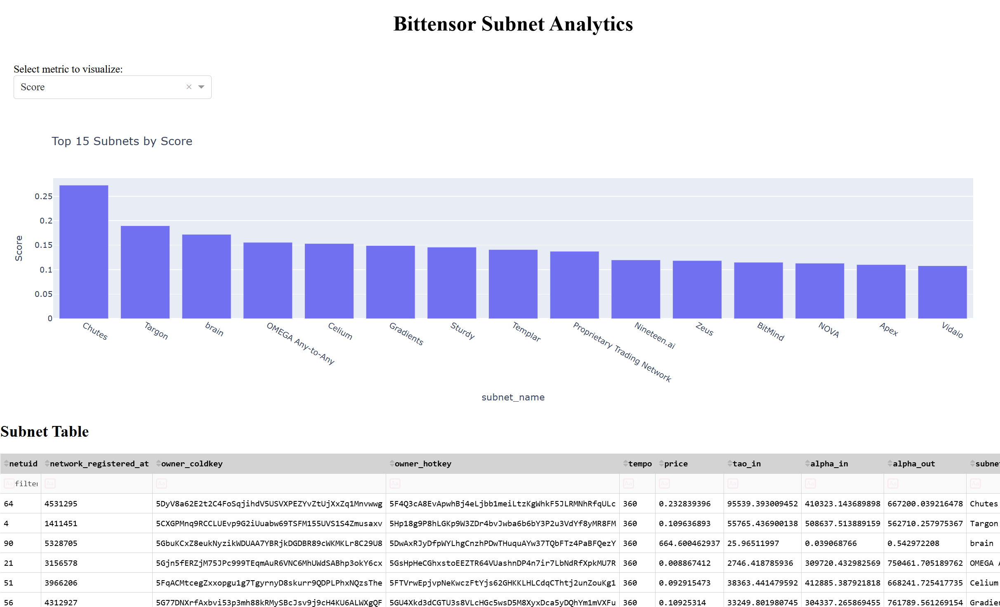

# Chapter 3: Subnet Scoring — Our First Model

In the previous chapter, we examined the fundamental structure of each subnet — from its TAO holdings and price to metadata like GitHub links and community presence. Now, we take our first step into building something more opinionated:

> A basic scoring model to assess and rank Bittensor subnets.

While this model is just a starting point, it marks the transition from passive data display to active interpretation.

---

## 🧮 What Is the Score?

The **score** is a weighted combination of key indicators we believe are early signals of subnet quality:

| Feature                 | Why We Use It |
|-------------------------|-----------------------------|
| `tao_in`                | Reflects trust, stake, and economic weight |
| `price`                | A proxy for demand or perceived value |
| `price_7d_pct_change`  | Measures recent trend or momentum |
| GitHub link present     | Suggests open development and transparency |
| Website present         | Indicates communication and credibility |

Each of these values is **normalized** to a 0–1 scale, and then combined using weighted coefficients (from `config.py`).

---

## ⚙️ Our First Scoring Formula

```python
score = (
    norm_tao_in       * 0.20 +
    norm_price        * 0.10 +
    norm_price_trend  * 0.10 +
    has_github        * 0.05 +
    has_website       * 0.05
)
```

The weights are easy to adjust later. We keep them simple now so that each factor is understandable.

---

## 🔗 Where Does the Data Come From?

We combine two TAO.app API endpoints:

- `/api/beta/analytics/subnets/info` → gives current TAO-in, price, metadata
- `/api/beta/subnet_screener` → gives `price_7d_pct_change` and other deltas

These datasets are merged using `netuid`, a unique identifier for each subnet.

---

## 📊 The Dashboard in Action

The updated dashboard now includes:

- A **dropdown menu** to select the metric to visualize
- A **bar chart** showing top 15 subnets by the selected metric
- A **sortable table** with all subnets and their scores



---

## 🧭 What This Tells Us

Even with this basic score, we already see useful patterns:

- Subnets with large TAO-in but no GitHub rank lower than expected.
- New subnets with fast price growth start surfacing near the top.
- Dead or inactive subnets drop down the list naturally.

This builds our confidence that even a simple scoring model can help surface insights that aren't obvious from raw values alone.

---

## ⏭️ Coming Up Next

Next, we'll start expanding the data model:

- Include APY data from `/apy/alpha`
- Integrate whale tracking using `/holders`
- Consider price sustainability and emission logic

And we'll revisit our scoring formula with each new layer — evolving our model just like the network itself.

